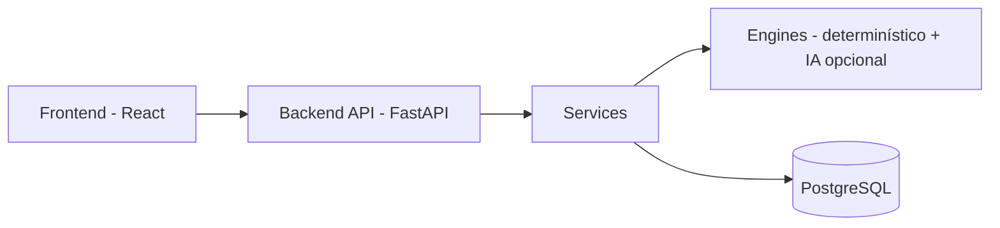

# AI Career Intelligence Platform

Plataforma para comparar currículos em PDF com vagas de tecnologia, IA, dados e engenharia de software, gerando score explicável, lacunas técnicas e recomendações práticas.

---


[](https://github.com/gabryellep/ai-resume-analyzer/actions/workflows/ci.yml)


---

## Demo

- **Frontend:** https://ai-career-intelligence-platform-beta.vercel.app/
- **Backend/API:** https://ai-resume-analyzer-wh05.onrender.com
- **Swagger:** https://ai-resume-analyzer-wh05.onrender.com/docs

> O frontend público já usa o nome novo do produto. O backend ainda mantém o domínio técnico original no Render. Como ele roda em plano gratuito, a primeira requisição após um período de inatividade pode demorar alguns segundos.

---

## Overview

Candidatos raramente sabem, de forma objetiva, o quanto seu currículo atende aos requisitos de uma vaga específica — nem quais gaps priorizar antes de se candidatar. Esta plataforma resolve isso: você envia um currículo em PDF e a descrição de uma vaga, e recebe em segundos um score de compatibilidade explicável, as skills atendidas/faltantes/parciais/extras e recomendações práticas.

A ferramenta foi projetada e testada para vagas de **tecnologia, IA/dados e engenharia de software** — o dicionário de skills e as recomendações refletem esse domínio. Para vagas fora da área tech, os resultados tendem a ser menos precisos.

O **score é sempre calculado por um motor determinístico e explicável** (regras, aliases, matching ponderado) — nunca por um modelo de IA. A plataforma também inclui duas camadas opcionais de IA (matching semântico via embeddings e feedback textual via LLM local) que **enriquecem** a resposta quando ligadas explicitamente, mas nunca substituem nem influenciam o score determinístico. Detalhes completos em [docs/technical-details.md](docs/technical-details.md).

---

## Key Features

- Upload de currículo em PDF e campo de descrição da vaga
- Score de compatibilidade explicável (0–100)
- Skills classificadas em atendidas, faltantes, parcialmente atendidas e extras
- Recomendações práticas e acionáveis
- Career Improvement Plan determinístico para transformar gaps reais em estudo, prática e evidências
- Processamento local e privacy-first (PDF nunca é persistido — ver [PRIVACY.md](PRIVACY.md))
- Histórico e dashboard de análises (local/dev)
- Matching semântico opcional via embeddings (local/dev)
- Feedback textual opcional via LLM local, Ollama (local/dev)

---

## How It Works

1. Extrai o texto do PDF do currículo.
2. Normaliza skills e aplica aliases (ex.: "Postgres" → "PostgreSQL").
3. Compara as skills do currículo com as exigidas pela vaga.
4. Calcula um score explicável.
5. Gera recomendações práticas de melhoria.

```text
score = round(pontos_obtidos / total_de_skills_exigidas * 100)
# skill atendida = 1.0 ponto · parcial = 0.5 · ausente = 0
```

Detalhamento completo (aliases, detecção de idioma, exemplos) em [docs/technical-details.md](docs/technical-details.md).

---

## Production vs. Local Features

| Feature | Demo pública | Local/dev | Por quê |
|---|---|---|---|
| Análise principal (score, skills, recomendações) | ✅ | ✅ | Pronto para produção |
| Histórico e dashboard | ❌ | ✅ | Exige autenticação real antes de expor publicamente |
| Matching semântico (embeddings) | ❌ | ✅ | Dependência pesada, incompatível com o plano gratuito de deploy |
| Feedback via LLM local (Ollama) | ❌ | ✅ | Exige um processo Ollama rodando — não existe no ambiente de deploy |

Nenhuma dessas capacidades está incompleta — todas têm testes automatizados e documentação própria. Elas ficam desligadas em produção por decisões explícitas, não por falta de implementação. Detalhes em [docs/deploy-checklist.md](docs/deploy-checklist.md).

---

## Tech Stack

| Camada | Tecnologias |
|---|---|
| Backend | FastAPI, Python 3.11+, PyMuPDF, Pydantic |
| Banco de dados | PostgreSQL, SQLAlchemy, Alembic |
| Frontend | React, Vite, CSS |
| IA/NLP | Motor determinístico (sempre ativo) · `sentence-transformers` (opcional) · Ollama (opcional) |
| DevOps | Docker, GitHub Actions, Render, Vercel |
| Qualidade | pytest, Ruff, Black |

---

## Architecture



- **Frontend**: upload do currículo, exibição do resultado, histórico/dashboard.
- **API**: rotas HTTP finas — validação de entrada e delegação, sem lógica de negócio.
- **Services**: orquestram a análise e a persistência; único ponto que conhece banco de dados e integrações externas (LLM).
- **Engines**: motor determinístico (sempre ativo) e motor semântico (opcional) — nunca conhecem banco de dados ou HTTP diretamente.
- **Banco de dados**: PostgreSQL — persiste apenas hashes, metadados e o resultado estruturado da análise, nunca o PDF ou o texto bruto.

---

## Screenshots

Checklist de capturas e instruções em [docs/images/README.md](docs/images/README.md) — ainda não capturadas nesta versão.

---

## Quick Start

### Com Docker (recomendado)

```bash
cp .env.example .env
docker compose up --build
```

| Serviço | URL |
|---|---|
| Frontend | http://localhost:5173 |
| Backend | http://localhost:8000 |
| Swagger | http://localhost:8000/docs |

### Manualmente

```bash
# Backend
cd backend
python -m venv venv && source venv/bin/activate  # Windows: venv\Scripts\activate
pip install -r requirements.txt
uvicorn main:app --reload

# Frontend (em outro terminal)
cd frontend
npm install
npm run dev
```

Rodando fora do Docker, é necessário um PostgreSQL acessível via `DATABASE_URL` e aplicar as migrations (`alembic upgrade head`). Sem isso, a análise continua funcionando normalmente — apenas a persistência é pulada.

---

## API Example

`POST /analyze` — `multipart/form-data` com `file` (PDF) e `job_description` (string).

```json
{
  "score": 75,
  "matched_skills": ["python", "fastapi", "docker"],
  "missing_skills": ["postgresql"],
  "partial_skills": [],
  "extra_skills": ["react", "github actions"],
  "recommendations": [
    "A vaga exige postgresql. Crie um projeto prático e publique no GitHub com documentação clara."
  ]
}
```

Contrato completo (incluindo Career Improvement Plan, campos opcionais de matching semântico e LLM) em [docs/technical-details.md](docs/technical-details.md#api-completa).

---

## Testing

```bash
cd backend
ruff check .
black --check .
pytest tests/ -v --cov=app --cov-report=term-missing --cov-fail-under=80

cd ../frontend
npm run build
```

A suíte cobre parser, extração de skills, matching, score, recomendações, rotas da API, persistência, histórico, analytics, matching semântico e feedback via LLM (estes dois últimos com mock/stub, sem dependência de rede real). Detalhes de cobertura em [docs/technical-details.md](docs/technical-details.md#testes-e-ci).

---

## Privacy and Limitations

- PDF e texto bruto do currículo/vaga **nunca são persistidos** — apenas hashes e o resultado estruturado.
- Sessão anônima (`X-Session-Id`) isola histórico/analytics por navegador, mas **não é autenticação real**.
- Sem OCR para PDFs baseados em imagem.
- Focado em vagas de tecnologia — não recomendado para outras áreas.
- **Não garante contratação, aprovação em processo seletivo, ou qualquer resultado de emprego.**

Detalhamento completo em [PRIVACY.md](PRIVACY.md).

---

## Roadmap

- Gráficos profissionais no frontend
- Radar de skills
- Plano de evolução de carreira
- Distinção entre requisitos obrigatórios e desejáveis
- Detecção de senioridade
- Comparação com múltiplas vagas
- Exportação do resultado em PDF
- Autenticação de usuários
- Dashboard seguro para produção

Detalhes e contexto de cada item em [docs/roadmap.md](docs/roadmap.md).

---

## Portfolio Highlights

- **AI Engineering**: motor determinístico como baseline auditável; matching semântico calibrado empiricamente com métricas reais (precision/recall/F1); integração com LLM local com validação estrita de saída e fallback em camadas.
- **Software Engineering**: arquitetura em camadas, testes automatizados contra PostgreSQL real (não só mocks), migrations aditivas, CI validando lint/formatação/testes/build a cada push.
- **Product thinking**: separação clara entre o que está pronto, o que é local/dev e o que é roadmap — nenhuma capacidade é apresentada como mais madura do que realmente é.
- **Privacy/security**: hashes em vez de dados brutos desde o design inicial; nenhum dado sensível enviado às camadas opcionais de IA.

---

## Links

- [PRIVACY.md](PRIVACY.md) — tratamento de dados e privacidade
- [docs/deploy-checklist.md](docs/deploy-checklist.md) — checklist de variáveis e decisões de deploy
- [docs/technical-details.md](docs/technical-details.md) — detalhamento técnico completo
- [docs/roadmap.md](docs/roadmap.md) — roadmap detalhado
- [docs/linkedin-post.md](docs/linkedin-post.md) — textos prontos para divulgação
- [docs/images/README.md](docs/images/README.md) — checklist de screenshots
- [LICENSE](LICENSE) — MIT
